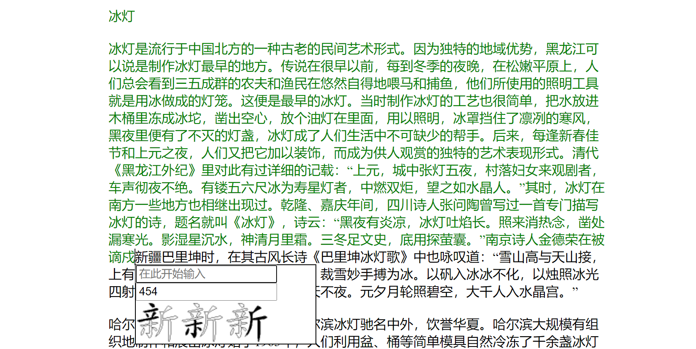
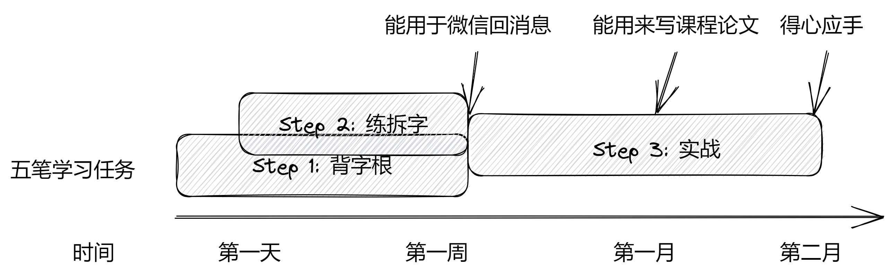

# 86 五笔在线练习

练习网页：[wongsingfo.github.io/86wubi/](https://wongsingfo.github.io/86wubi/)

## 简介

本项目实现了一个用于练习 86 五笔输入法拆字规则的网页应用。网页自动适应桌面端和移动端，并能保存练习进度。应用界面如下图。

## 为什么要设计这样一个应用

根据笔者自身的经历，学习五笔最困难的是拆字根。目前我能找到的五笔练习工具主要有三类，但它们对学习拆字根帮助不大，或者使用起来比较麻烦：一是练习字根的。屏幕上显示字根，用户键入对应的字母。这种方法只在早期学习的时候有帮助。二是练习简码的。笔者认为除若干一级简码外（比如：我，是，这，有），其他简码没有必要学习，因为其本就遵循输入规律，没有必要额外花精力学习，反而该学习过程会消磨学习的兴趣。三是字根查询，这是非常有用的工具，然而每次查询需要繁琐的步骤，容易打乱当前的学习节奏：首先要切换到该工具的界面，然后切换到拼音或手写输入，最后查询完还要切换回来。目前，很多输入法（比如微软操作系统原生的输入法）可以通过输入拼音显示五笔编码，可以作为辅助工具。

为了练习拆字根，同时不失趣味性，笔者制作了这一简易应用。应用可以自定义要输入的文本，并在输入的同时显示拆字方案。笔者使用该应用一共练习了《冰灯》和《浅谈广州早茶由文化》两篇文章，就基本掌握了五笔的拆字规则。

## 学习路径分享

下图是笔者自己的学习路线，供参考。

## 当今学习五笔的价值

- 提高键盘输入的速度。当然，在日常使用时，个人体验是五笔输入不如语音输入。
- 感受前人的智慧。推荐阅读材料 [Bilibili：让汉字进入电脑有多难？全世界都失败了，这群中国人成功了](https://www.bilibili.com/video/BV1VP4y1V7RC)
- 减轻“电脑失写症”的症状。

## 项目实现

### 拆字图片

本项目收录了国务院 2013 公布的《通用规范汉字表》一级字表和二级字表中**部分**的拆字图片，一共 3355 个汉字。项目的拆字图片来自于 wb86.com 和 52wubi.com 站点。

### Star History

